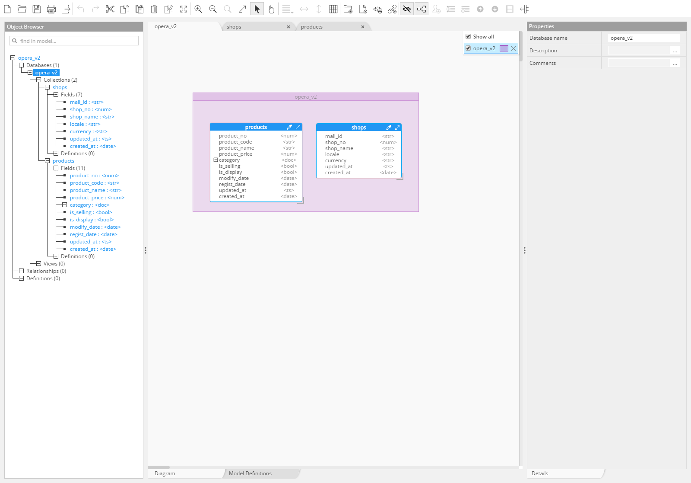

MongoDB 사용시 유용한 Tool에 대해 정리합니다.

## Database Management Tool
MongoDB는 JavaScript 문법으로 터미널을 통한 작업만으로는 다소 불편함이 있습니다.
RDB 또한 이러한 불편으로 SQL Server (MSSQL), Toad(Oracle, MySQL), Workbench(Mysql) 등의 매니지먼트 툴이 존재하며, 쿼리 작성 및 실행, 데이터 모델링을 할수있는 편의 기능들을 제공합니다.
MongoDB 는 NoSQL 이지만 DB 또는 Collection의 옵션등을 포함하는 스키마 데이터를 포함하며,
비정형화된 데이터를 관리하기 위한 모델링을 필요로 하기때문에 이를 지원하기 위한 Tool 이 필요하다 판단되어 이에 대한 조사 및 Post 작성을 하게 되었습니다.

### Robo 3T
* **설명** : 임베디드 쉘이 있는 MongoDB GUI로 MongoDB에 접속해 쿼리를 작성하고 실행결과를 볼수있는 심플한 GUI를 제공한다.
* **사용성** : 쿼리 입력창에 한글입력이 제대로 되지 않아 사용상 어려움이 있는 것으로 확인됨.
* **라이센스** : 무료
* **공식사이트** : https://robomongo.org/

### Studio 3t
* **설명** : Robo 3T와 마찬가지로 `robomongo` 에서 출시된 전문가용 MongoDB IDE로써 아래의 기능들을 포함합니다.
    * 임베디드 쉘이 있는 GUI
    * 비주얼 쿼리 빌더
    * 인 플레이스 편집
    * 자동완성 기능이 있는 IntelliShell
    * SQL DB Import / Export
    * 집계 파이프 라인 편집기
    * And so much more...
* **사용성** : Robo 3T에서 문제로 확인되었던 한글입력문제가 없고, 사이트에서 소개하는 많은 기능들을 제공함. 다만 라이센스가 유료.
* **라이센스** : 유료
* **공식사이트** : https://robomongo.org/

## Data Modeling Tool
### Hackolate
* **사이트** : https://hackolade.com
* **라이센스** : 유료
* **사용성** : MongoDB 이외에도 상당히 다양한 NoSQL 제품군의 데이터 모델링을 위한 기능을 제공한다. 유료 라이센스라서 그런지 모르겠으나 15일 Trial Version으로 사용해본 바 Reverse Engineering 은 되지만 Forward Engineering 이 Submit을 해도 적용되지 않는다.
NoSQL의 Document 기반 ERD를 작성하기 위한 제품별 기능들을 제공하나 제품별 세부적인 스키마 정보를 포함하지는 않는 것 같다..






<!--  -->
<!-- 
 -->